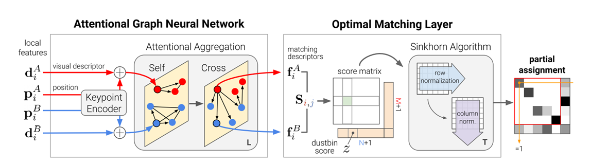
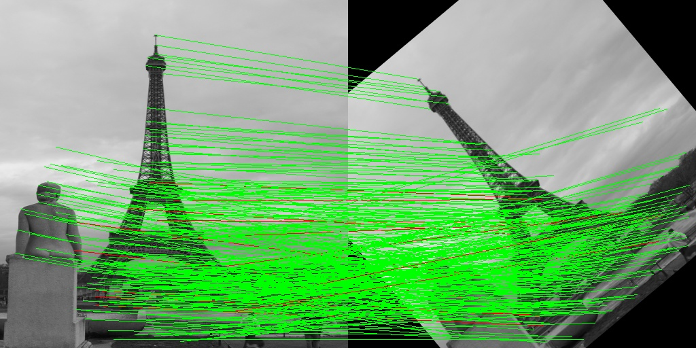
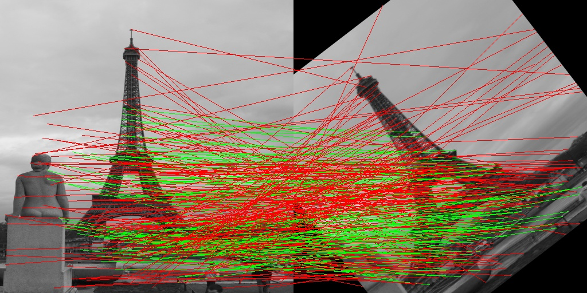
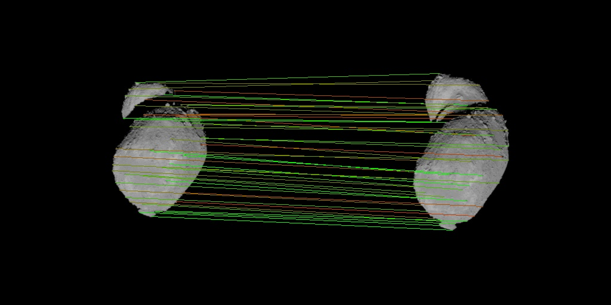

# 
SuperGlue: Learning Feature Matching with Graph Neural Networks (CVPR 2020)

苏睿 2001111334

---
1. 算法介绍
    &nbsp;&nbsp;&nbsp;&nbsp; 在二三维重建任务中，我们需要对图片的局部特征匹配来估计各相机的位姿，大的视角和光照变化、遮挡、模糊、弱纹理都会影响我们匹配的精度，论文受GNN和Transformer的启发，提出了基于图神经网络的SuperGlue模型。
    &nbsp;
    &nbsp;&nbsp;&nbsp;&nbsp; 考虑两张图片 A 和 B，分别有 M 和 N 个特征，其中每个特征都由该特征点在图片中的位置和前一阶段获取的特征描述向量组成。即 local features := (**p**, **d**), **p** 为特征点在图片中的位置， **d** 为特征描述向量。
    &nbsp;&nbsp;&nbsp;&nbsp; 我们的目标是求得一个部分软赋值矩阵 $\bold P\in [0, 1]^{M\times N}$，其每个位置的值表示两图片对应位置特征的匹配程度，其需要满足约束，每个特征至多匹配一个特征，即 $\bold P\bold1_N\le\bold1_M,\bold P^T\bold1_M\le1_N$ 。
    &nbsp;
    &nbsp;&nbsp;&nbsp;&nbsp; SuperGlue的结构如下图所示：
    
    (1). **Attentional Graph Neural Network**
    &nbsp;&nbsp;&nbsp;&nbsp; 网络的前半部分为一个AGNN，其作用是将网络输入所给的局部特征（包含位置和特征描述向量），通过 keypoint encoder 和 self- and cross- attention layers 转化为一个更强的特征表示 **f** 。
    &nbsp;&nbsp;&nbsp;&nbsp; **Keypoint Encoder :** 将特征在图片中的位置通过MLP后与特征描述向量拼接成新的特征。
    $$
    ^{(0)}\bold{x_i}=\bold{d_i}+\bold{MLP}_{enc}(\bold{p_i})
    $$
    &nbsp;&nbsp;&nbsp;&nbsp; **Multiplex Graph Neural Network :** 对两张图片的特征循环进行self attention和cross attention以获得更强的特征表示。
    $$
    ^{(l+1)}\bold{x_i}^A=^{(l)}\bold{x_i}^A+\bold{MLP}([^{(l)}\bold{x_i}^A||\bold{m}_{\epsilon \rightarrow i}])
    $$
    &nbsp;&nbsp;&nbsp;&nbsp; 其中 $\bold{m}_{\epsilon \rightarrow i}$ 表示对边集 $\epsilon$ 中与 i 相连的所有边进行特征聚合。
    $$
    \bold{m}_{\epsilon \rightarrow i} = \sum_{j:(i,j)\in\epsilon}{\alpha_{ij}\bold{v}_j}, \alpha_{ij}=Softmax_j(\bold{q}_i^T\bold{k}_j)
    $$
    &nbsp;&nbsp;&nbsp;&nbsp; 其中 $\bold{v}_j$ 为 j 的值，$\alpha_{ij}$ 表示 j 对 i 的影响程度，由 i 的 $\bold{q}_i^T$ 和 j 的 $\bold{k}_j$ 计算得来。此处的 $\bold{v}_j, \bold{q}_i^T, \bold{k}_j$ 均为该层的 deep feature 线性映射而来。
    $$
    \bold{q}_i^T=\bold{W}_1^{l}\bold{x}_i^Q+\bold{b}_1 \\
    \bold{v}_j=\bold{W}_2^{l}\bold{x}_j^S+\bold{b}_2 \\
    \bold{k}_j=\bold{W}_3^{l}\bold{x}_j^S+\bold{b}_3
    $$
    &nbsp;&nbsp;&nbsp;&nbsp; 在此部分中，图的边分为图片内的边和图片间的边，图片内的边由每个点与相同图片中的所有点相连接构成，图片间的边由每个点与不同图片中的所有点相连接构成，两种连接方式分别生成 intra-image edges $\epsilon_{self}$ 和 inter-image edges $\epsilon_{cross}$，将上述计算交替地在两种图上执行，奇数层为intra image, 偶数层为inter image，从而构成了此处的GNN。
    &nbsp;&nbsp;&nbsp;&nbsp; **Final matching descriptors :** 对最后一层的特征进行线性映射得到最终的更强的特征表示。
    $$
    \bold{f}_i^A=\bold{W}\cdot ^{(L)}\bold{x_i}^A + \bold{b}, \forall i \in A
    $$
    &nbsp;
    (2). **Optimal Matching Layer**
    &nbsp;&nbsp;&nbsp;&nbsp; 网络的后半部分利用更强的特征表示计算得到匹配分数矩阵，并通过可微的优化方法使其满足最初我们要求的约束，从而得到最终的部分软赋值矩阵。
    &nbsp;&nbsp;&nbsp;&nbsp; **Score Prediction :** 将特征简单点乘得到各特征间初始的匹配得分矩阵。
    $$
    \bold{S}_{ij}=<\bold{f}_i^A,\bold{f}_j^B>,\forall(i,j)\in A\times B
    $$
    &nbsp;&nbsp;&nbsp;&nbsp; **Occlusion and Visibility :** 为了处理未匹配的特征点并且满足之后 sinkhorn iteration 的要求，我们在 $\bold{S}$ 中添加 未匹配行 和 未匹配列。
    $$
    \bold{S}_{i,N+1}=\bold{S}_{M+1,j}=\bold{S}_{M+1,N+1}=z\in \R
    $$
    其中 z 为可学习的参数。
    &nbsp;&nbsp;&nbsp;&nbsp; 于是原约束条件转化为 $\bold{S 1_{N+1}}=\bold{a},\bold{S^T 1_{M+1}}=\bold{b}$ ， $\bold{a}=[\bold1_M,N]^T, \bold{b}=[\bold1_N, M]^T$ 。
    &nbsp;&nbsp;&nbsp;&nbsp; **Sinkhorn Algorithm :** 此方法是解决最优传输问题的算法，给定两个离散分布 a 和 b 及其偏好矩阵 S，通过行归一化、列归一化不断迭代的方式优化得到最终的传输矩阵 P。我们直接应用该方法即可得到最终的部分软赋值矩阵。
    &nbsp;
    (3) **loss function**
    &nbsp;&nbsp;&nbsp;&nbsp; 监督学习，分类问题，我们有真实的匹配对$M={(i,.j)}\subset{A\times B}$，未匹配点 $I\subseteq A$，$J\subseteq B$。
    $$
    Loss=-\sum_{(i,j)\in M}\log\bold{P}_{i,j}-\sum_{i\in I}\log\bold{P}_{i,N+1}-\sum_{j\in J}\log\bold{P}_{M+1,j}
    $$
    &nbsp;
2. 实现
    &nbsp;
    &nbsp;&nbsp;&nbsp;&nbsp; [代码链接](&nbsp;&nbsp;&nbsp;&nbsp;)
    &nbsp;

    &nbsp;&nbsp;&nbsp;&nbsp; 数据集，这里使用的合成数据集，下载 [The Paris Dataset](https://www.robots.ox.ac.uk/~vgg/data/parisbuildings/)，`SyntheticDataset.py` 读取图片，并对每张图片进行 随机亮度、随机对比度、随机仿射变换、随机裁剪 的操作后得到图片对，和两张图片的变换矩阵，将该数据集作为我们训练和测试的数据集。
    &nbsp;&nbsp;&nbsp;&nbsp; `superpoint.py` 用于提取特征，和论文关系不大，也可以使用opencv中的SIFT，此文件直接使用论文源码的文件。
    &nbsp;&nbsp;&nbsp;&nbsp; `superglue.py` 参考了论文源码的文件，由于论文源码并不支持训练，所以稍微修改使其能够返回所求的部分软赋值矩阵。
    &nbsp;&nbsp;&nbsp;&nbsp; `train.py` 训练网络，由于显卡的显存不足，这里设置了superpoint 提取的最大特征数量为 1024，直接 `python train.py` 即可运行，未设置命令行参数。
    &nbsp;&nbsp;&nbsp;&nbsp; `visualization.py` 输入任意两张图片绘制网络输出的匹配，匹配颜色为网络输出的匹配分数（越绿分数越高），`python visualization.py img0 img1 [-o output] [-m model]` 。
    &nbsp;&nbsp;&nbsp;&nbsp; `test_visualization.py` 输入单张图片，经过处理后得到图片对进行匹配，并将正确的匹配结果绘制为绿色，错误的绘制为红色，`python test_visualizatoin.py img [-o output] [-m model]`。
    &nbsp;&nbsp;&nbsp;&nbsp; `utils.py` 用于绘制匹配图。
    &nbsp;
3. 结果
    &nbsp;&nbsp;&nbsp;&nbsp; 由于我们的数据集图像变换操作有限，训练后能够较快地学习到匹配的特征，效果如图所示：
    
    &nbsp;&nbsp;&nbsp;&nbsp; 而使用论文预训练好的 outdoor 模型则没有这么好的效果。
    
    &nbsp;
    &nbsp;&nbsp;&nbsp;&nbsp; 对小行星数据进行匹配可以得到如下结果，（由于我们没有真实值，所以只绘制了网络的匹配分数）：
    
    &nbsp;&nbsp;&nbsp;&nbsp; 看不出两图应有的匹配，并不能确定效果好坏，不过似乎看起来还可以?